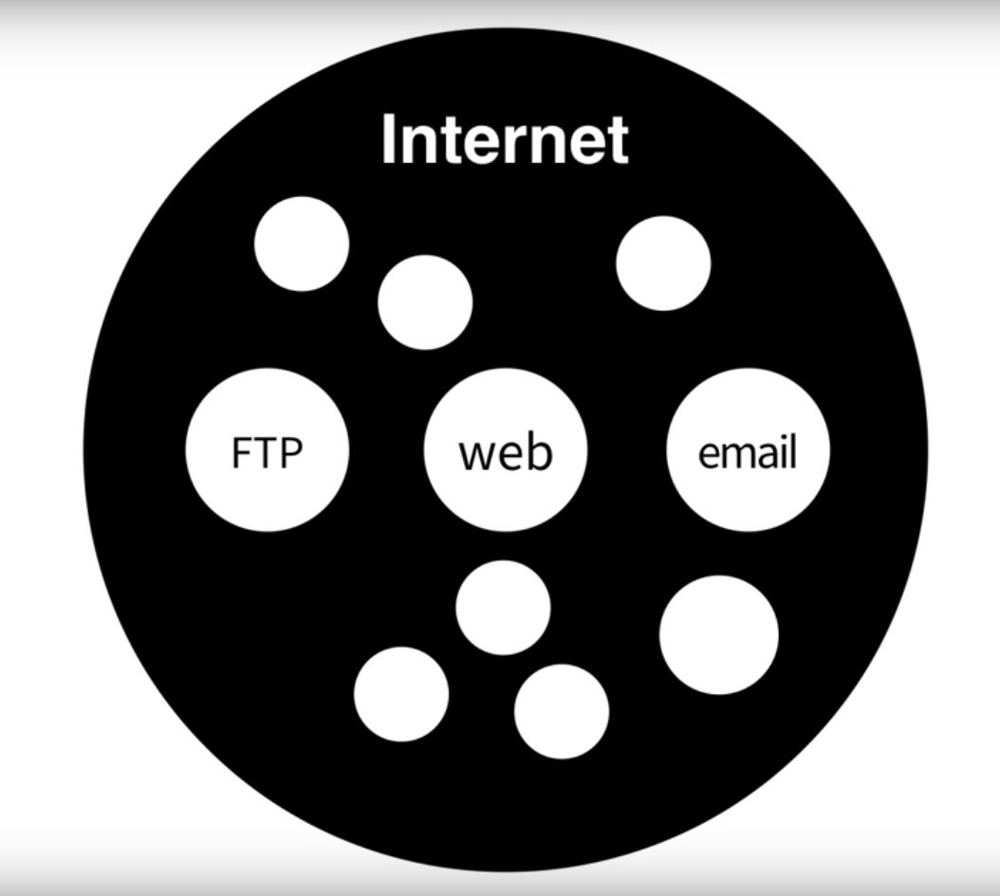
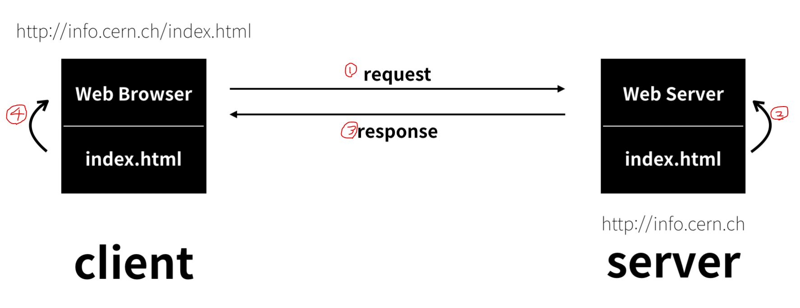

# 코딩야학 1-2일차

### WEB1-1 ~ 1-5 / 1-6 ~ 1-8
##### WEB에 대해
- Public domain : 저작권이 없는 것들
- HTML : HyperText Markup Language
- TAG : 문법
  * 통계 : https://www.advancedwebranking.com/html/

***
# 코딩야학 3일차

### WEB 1-9 ~ 1-11
##### TAG에 대해, HTML에 대해
- p Tag : 단락 나눔 
- br Tag : 줄바꿈
- img Tag : 이미지
  * 속성 : 이미지 소스(src), 넓이(width) 등등..
  * 고퀄 이미지 : https://unsplash.com/

***
# 코딩야학 4일차

### WEB 1-12 ~ 1-14
##### 중요 TAG 및 기타 TAG

###### 기타 Tag
- list : ul > li | ol > li

###### html Tag 
- `<!doctype html> <html> </html>`

###### 본문설명 Tag(`<head> </head>`)
- html의 본문을 어떻게 표현할지 설명(지정)하는 TAG
- 웹 Tab 제목 설정 : title Tag
- 인코딩방식(언어 설정) : meta tag  
  * ex) `<meta charset="utf-8">`

###### 본문 Tag(`<body> </body>`)
- html의 본문을 표현하는 TAG

##### Link Tag(``)
- href : 링크 주소정보
  * ex) `<a href="주소">링크걸 내용</a>`
- target : 링크 열기 속성(_blank : 새탭)
  * ex) ``
- title : 링크 팁
  * ex) ``

***
# 코딩야학 5일차

### WEB 1-15
##### 웹 사이트
- 링크로 결합된 웹 페이지 그룹

***
# 코딩야학 6일차

### WEB 1-16 ~ 1-17
##### 원시 웹
- Internet VS WEB
  
- 인터넷의 시작 : 분산 형태의 통신 시스템
- WEB은 SWISS에서 시작 : 팀버너스리 1994년

##### 서버와 클라이언트
- 컴퓨터 2대 : 인터넷이 동작하기 위해 필요
  - Web Browser : http://info.cern.ch/index.html (브라우저 주소)
  - Web Server : http://info.cern.ch (최초 컴퓨터 서버)
  - 

***
# 코딩야학 7일차

### WEB 1-18
##### 웹 호스팅
- Github 사용하기.
  1. new repository
  2. upload file
  3. setting > Pages > master branch 선택

***
# 코딩야학 8일차

### WEB 1-19 ~ 1-21
##### 웹 서버 운영

***
# 코딩야학 9일차

### WEB 1-22 ~ 1-23
##### 수업을 마치며

***
# 코딩야학 10일차

### WEB 1-24
##### 수업을 마치며 마무리

***
# 코딩야학 부록

##### 부록

***
#### 프로젝트 - 기획
1.IDEAS
* 나의 블로그 - 처음부터 끝까지 개발해보기.

***
#### 기획하기

